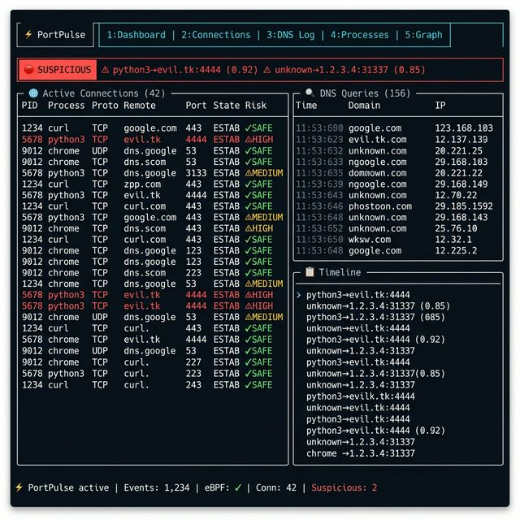
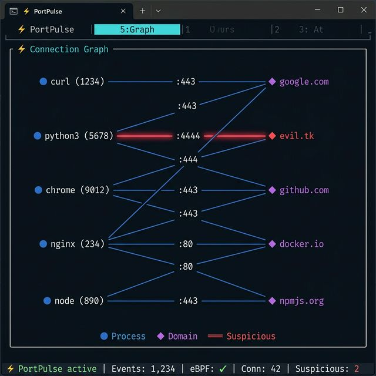
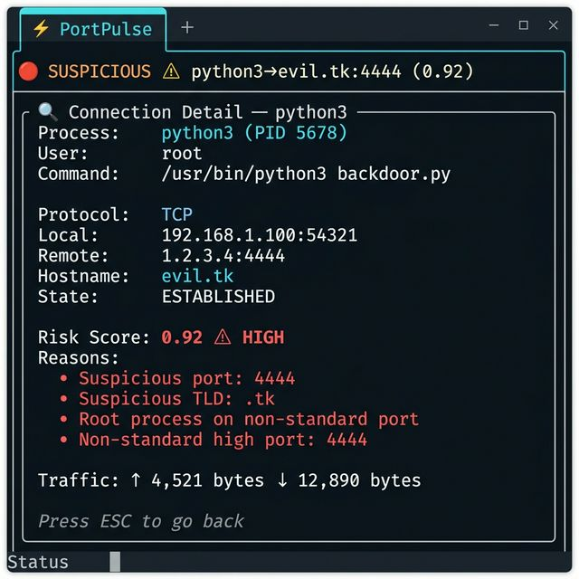

<div align="center">

# ⚡ PortPulse

### See every Linux process, port, connection, and DNS lookup live in one interactive map.

[](LICENSE)
[](https://www.rust-lang.org/)
[](https://ebpf.io/)
[](CONTRIBUTING.md)

**🔍 What process is talking? 🌐 To which domain? 🚪 Through which port? ⚠️ With what risk?**

<br>



*Real-time dashboard: connections, DNS queries, timeline, and suspicious activity — all in one view*

<br>

### 🎬 See it in Action


*30-second demo: status check → port explanation → process tracing → live TUI dashboard*

</div>

---

## 🚀 Why PortPulse?

Linux debugging is **fragmented**. You juggle between `ss`, `netstat`, `lsof`, DNS logs, process trees, and firewall rules — all disconnected, all manual.

**PortPulse unifies everything** into a single real-time command center:

| Traditional Way | PortPulse Way |
|---|---|
| `ss -tupn` + `lsof -i` + `dig` | `portpulse live` |
| Manually correlating PIDs to connections | Auto-correlated process → port → domain mapping |
| No risk assessment | Built-in heuristic risk scoring (0.0 → 1.0) |
| Separate tools for each task | One unified TUI with 5 views |
| No DNS visibility | Real-time DNS query capture |
| No container awareness | Docker/Kubernetes container detection |

---

## ⚡ Quickstart

```bash
# Install from source
git clone https://github.com/the-shadow-0/PortPulse.git
cd portpulse && cargo install --path crates/cli

# Launch the dashboard (use sudo for eBPF probes)
sudo portpulse live
```

That's it. **Two commands** to full network visibility.

---

## ✨ Features

### 🌐 Live Process-to-Port Mapping
See every active connection with its owning process, user, container, and domain in real-time.

### 🔍 DNS Query Capture
Catch every DNS resolution as it happens — see which process queried what domain, when, and what it resolved to.

### ⚠️ Risk Scoring Engine
Every connection is scored from 0.0 (safe) to 1.0 (critical) using heuristics:
- Suspicious TLDs (`.tk`, `.ml`, `.xyz`)
- Known bad ports (4444, 31337, 6667)
- Domain entropy (DGA detection)
- DNS tunneling patterns
- Unknown/unnamed processes
- Root processes on non-standard ports

### 🔴 Suspicious Lane
A persistent alert bar at the top of the screen highlighting high-risk connections with blinking indicators.

### ⚡ Animated Connection Graph
The WOW feature — processes and domains connected by live-updating edges:
- **Blue** for normal connections
- **Pulsing red** for suspicious activity
- Port labels at edge midpoints
- Legend with node type icons

<div align="center">


*Interactive connection graph: processes ↔ domains with live risk coloring*
</div>

### 🌳 Process Tree View
Hierarchical view of processes with tree-drawing characters, showing connection counts per process.

### 📋 Timeline
Chronological log of all network events: connections opened/closed, DNS queries, policy violations.

### 🛡️ Policy Engine
Define custom rules:
- "Never talk to domain X"
- "Alert on port 4444"
- "Block IP range 10.0.0.0/8"
- "Alert when process Y makes connections"

### 🔒 Quarantine Mode
Generate `nftables` rules to block suspicious domains:
```bash
portpulse quarantine --domain evil.tk
```

### 📊 Export System
Export to JSON or CSV for SIEM integration:
```bash
portpulse export --format json --what connections -o report.json
```

---

## 📸 Screenshots

<div align="center">

### Dashboard View


*Unified dashboard: connections table, DNS log, and timeline in one split view*

### Connection Graph


*Animated graph showing process→domain connections with risk-colored edges*

### Connection Detail


*Deep-dive into a suspicious connection: risk score breakdown with actionable reasons*

</div>

---

## 🖥️ CLI Commands

```bash
portpulse live                       # Interactive TUI dashboard
portpulse live --threshold 0.3       # Lower suspicious threshold
portpulse live --no-ebpf             # Force /proc fallback mode

portpulse trace --pid 1234           # Trace a specific process
portpulse trace --pid 1234 -c        # Include child processes

portpulse explain 443                # What's using port 443?
portpulse explain 4444               # Why is port 4444 suspicious?

portpulse quarantine -d evil.tk      # Generate blocking rules
portpulse export -f csv -w all       # Export everything as CSV

portpulse status                     # Check eBPF & system status
```

---

## 🏗️ Architecture

```
┌─────────────────────────────────────────────────────────────┐
│                       User Interface                         │
│  ┌─────────┐  ┌──────────┐  ┌──────────┐  ┌──────────────┐ │
│  │   TUI   │  │   CLI    │  │  Export   │  │   Policy     │ │
│  │ ratatui │  │   clap   │  │ JSON/CSV │  │   Engine     │ │
│  └────┬────┘  └────┬─────┘  └────┬─────┘  └──────┬───────┘ │
│       │            │             │                │          │
│  ┌────▼────────────▼─────────────▼────────────────▼───────┐ │
│  │                    Core Engine                          │ │
│  │  ┌────────────┐  ┌────────────┐  ┌──────────────────┐  │ │
│  │  │ Aggregator │  │ Classifier │  │   Event Bus      │  │ │
│  │  │ (correlate)│  │ (risk)     │  │ (tokio broadcast)│  │ │
│  │  └────────────┘  └────────────┘  └──────────────────┘  │ │
│  └──────────────────────┬──────────────────────────────────┘ │
│                         │                                    │
│  ┌──────────────────────▼──────────────────────────────────┐ │
│  │                Event Source Layer                        │ │
│  │  ┌──────────────────┐    ┌────────────────────────────┐ │ │
│  │  │  eBPF Probes     │    │  /proc/net Fallback        │ │ │
│  │  │  (kprobes, tp)   │    │  (tcp, udp, tcp6, udp6)    │ │ │
│  │  │  via Aya         │    │  + /proc/*/fd inode scan   │ │ │
│  │  └──────────────────┘    └────────────────────────────┘ │ │
│  └─────────────────────────────────────────────────────────┘ │
│                                                              │
│  ┌───────────────────────────────────────────────────────────┤
│  │                    Linux Kernel                           │
│  │  tcp_v4_connect · inet_csk_accept · udp_sendmsg         │
│  │  tcp_set_state  · /proc/net/*     · socket inodes       │
│  └───────────────────────────────────────────────────────────┘
```

---

## ⚙️ Tech Stack

| Component | Technology | Why |
|---|---|---|
| **Core** | Rust | Zero-cost abstractions, memory safety, blazing performance |
| **Kernel Probes** | eBPF (via Aya) | Safe kernel-level tracing without kernel modules |
| **Terminal UI** | Ratatui + Crossterm | Modern TUI framework with rich widgets and canvas |
| **Async Runtime** | Tokio | High-throughput concurrent event processing |
| **CLI** | Clap | Ergonomic argument parsing with color output |
| **Serialization** | Serde | Fast JSON/CSV export |

---

## 📁 Project Structure

```
portpulse/
├── Cargo.toml                  # Workspace root
├── crates/
│   ├── core/                   # Core library
│   │   └── src/
│   │       ├── models.rs       # Data types (Connection, Process, RiskScore)
│   │       ├── event.rs        # Event pipeline & broadcast bus
│   │       ├── aggregator.rs   # Event correlation & state management
│   │       ├── classifier.rs   # Risk scoring engine
│   │       ├── policy.rs       # Policy rules & violation detection
│   │       ├── export.rs       # JSON/CSV export
│   │       ├── process.rs      # /proc process scanner
│   │       └── dns.rs          # DNS cache & reverse lookups
│   ├── ebpf/                   # eBPF layer
│   │   └── src/
│   │       ├── probes.rs       # Probe definitions (kprobes, tracepoints)
│   │       ├── loader.rs       # Aya-based eBPF loader
│   │       ├── reader.rs       # Perf buffer event reader
│   │       └── fallback.rs     # /proc/net/* polling fallback
│   ├── tui/                    # Terminal UI
│   │   └── src/
│   │       ├── app.rs          # Application state & input handling
│   │       ├── ui.rs           # Main layout renderer
│   │       ├── theme.rs        # Dark color system
│   │       └── widgets/        # UI components
│   │           ├── connections_table.rs
│   │           ├── suspicious_lane.rs
│   │           ├── dns_log.rs
│   │           ├── process_tree.rs
│   │           └── connection_graph.rs  # ⚡ Animated graph
│   └── cli/                    # CLI binary
│       └── src/
│           ├── main.rs         # Clap argument parser
│           └── commands/       # Subcommand handlers
│               ├── live.rs     # TUI dashboard
│               ├── trace.rs    # Process tracing
│               ├── explain.rs  # Port explanation
│               ├── quarantine.rs # Domain quarantine
│               ├── export.rs   # Data export
│               └── status.rs   # System status
├── docs/                       # Documentation
├── scripts/                    # Build & install scripts
└── examples/                   # Usage examples
```

---

## 🎯 Use Cases

### 🔐 Incident Response
> "Something is phoning home from this server — what process, what domain, when did it start?"

```bash
sudo portpulse live --threshold 0.3
```

### 🐳 Container Debugging
> "Which container is making unexpected network calls?"

PortPulse detects Docker/containerd containers automatically via cgroup analysis.

### 🛡️ Security Audit
> "Show me all connections to non-standard ports by root processes."

Use the filter (`/`) and sort (`s`) in the TUI to drill down instantly.

### 📊 Compliance Reporting
> "Export all network activity for audit review."

```bash
portpulse export --format csv --what all -o audit-report.csv
```

### 🐛 Dev Debugging
> "Why is my app connecting to this IP? What DNS resolution led there?"

```bash
portpulse trace --pid $(pgrep myapp) --children
portpulse explain 8080
```

---

## 🗺️ Roadmap

### v0.1 — MVP (Current)
- [x] Live connection monitoring
- [x] DNS query capture
- [x] Risk scoring engine
- [x] Animated connection graph
- [x] CLI commands (live, trace, explain, quarantine, export)
- [x] /proc fallback when eBPF unavailable

### v0.2 — Enhanced eBPF
- [ ] Full Aya eBPF program compilation
- [ ] TLS SNI detection
- [ ] TCP retransmission tracking
- [ ] Packet size histograms

### v0.3 — Intelligence
- [ ] Domain reputation API integration
- [ ] WHOIS enrichment
- [ ] GeoIP mapping
- [ ] Threat feed integration

### v0.4 — Kubernetes
- [ ] Pod-level network visibility
- [ ] Service mesh awareness
- [ ] NetworkPolicy suggestion
- [ ] Helm chart

### v1.0 — Production
- [ ] Daemon mode with gRPC API
- [ ] Web dashboard (optional)
- [ ] Plugin system
- [ ] Alert integrations (Slack, PagerDuty)

---

## 📦 Installation

### From Source (Recommended)
```bash
git clone https://github.com/the-shadow-0/PortPulse.git
cd portpulse
cargo install --path crates/cli
```

### One-Line Install
```bash
curl -sSf https://raw.githubusercontent.com/the-shadow-0/PortPulse/main/scripts/install.sh | sh
```

### Package Managers (Coming Soon)
```bash
# Homebrew
brew install portpulse

# Arch Linux (AUR)
yay -S portpulse

# Debian/Ubuntu
sudo dpkg -i portpulse_0.1.0_amd64.deb
```

---

## 🤝 Contributing

We welcome contributions! See [CONTRIBUTING.md](CONTRIBUTING.md) for details.

### Good First Issues
- Add more port descriptions to the `explain` command
- Add IPv6 support to the connection graph
- Implement sort-by-column in the connections table
- Add configurable color themes
- Write more unit tests for the classifier

### Plugin Ideas
- Prometheus metrics exporter
- Elasticsearch/OpenSearch sink
- Slack/Discord alerting
- Custom DNS resolvers
- GeoIP enrichment module

---

## 🔐 Security Model

- **Local-first**: All data stays on your machine. No telemetry, no phone-home.
- **Read-only eBPF**: Probes are strictly observational — they cannot modify kernel state.
- **No payload capture**: PortPulse captures metadata (IPs, ports, PIDs) — never packet contents.
- **Privilege separation**: eBPF requires root; the TUI can run unprivileged with /proc fallback.
- **Audit logging**: Every policy violation is logged with timestamps and evidence.

---

## 📄 License

MIT License — see [LICENSE](LICENSE) for details.

---

<div align="center">

**⚡ Built with Rust, eBPF, and ❤️ for the open-source community.**

[⬆ Back to top](#-portpulse)

</div>
